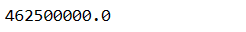

# Implementation-of-Decision-Tree-Regressor-Model-for-Predicting-the-Salary-of-the-Employee

## AIM:
To write a program to implement the Decision Tree Regressor Model for Predicting the Salary of the Employee.

## Equipments Required:
1. Hardware – PCs
2. Anaconda – Python 3.7 Installation / Jupyter notebook

## Algorithm
```
1.Import the required libraries.
2.Upload and read the dataset.
3.Check for any null values using the isnull() function.
4.From sklearn.tree import DecisionTreeClassifier and use criterion as entropy.
5.Find the accuracy of the model and predict the required values by importing the required module from sklearn.
```
## Program:
```
/*
Program to implement the Decision Tree Regressor Model for Predicting the Salary of the Employee.
Developed by: Guttha Keerthana
RegisterNumber: 212223240045

import pandas as pd
data=pd.read_csv("Salary.csv")
data.head()
data.info()

data.isnull().sum()

from sklearn.preprocessing import LabelEncoder
le = LabelEncoder()
data["Position"]=le.fit_transform(data["Position"])
data.head()


x= data[["Position","Level"]]
y=data["Salary"]

from sklearn.model_selection import train_test_split
x_train,x_test,y_train,y_test = train_test_split(x,y,test_size = 0.2,random_state = 2)

from sklearn.tree import DecisionTreeRegressor
dt = DecisionTreeRegressor()
dt.fit(x_train,y_train)
y_pred = dt.predict(x_test)

from sklearn import metrics
mse = metrics.mean_squared_error(y_test,y_pred)
mse

r2= metrics.r2_score(y_test,y_pred)
r2

dt.predict([[5,6]])
  
*/
```

## Output:

data.head()


data.info()


Null dataset


Data head after label encoder


MSE 



x.head()


## Result:
Thus the program to implement the Decision Tree Regressor Model for Predicting the Salary of the Employee is written and verified using python programming.
